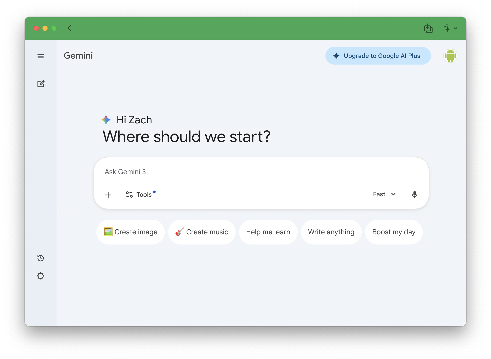
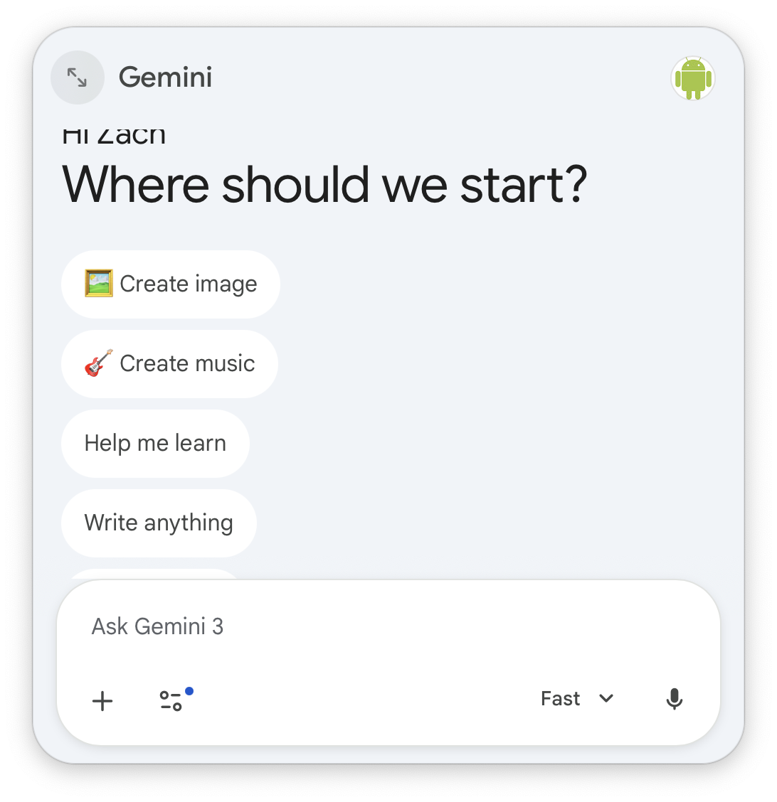
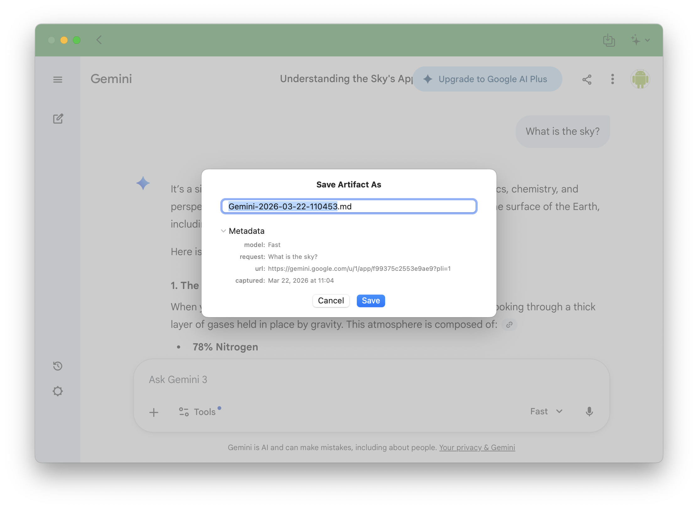
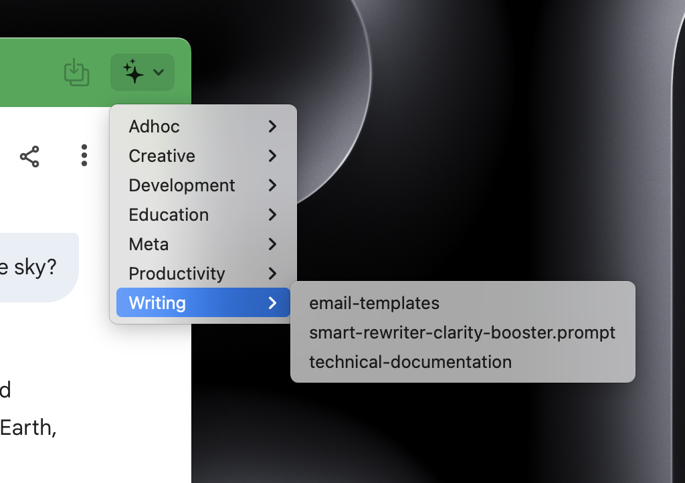

# Gemini Desktop for macOS (Unofficial)

An **unofficial macOS desktop wrapper** for Google Gemini (`https://gemini.google.com/app`).



> **Disclaimer:**
> This project is **not affiliated with, endorsed by, or sponsored by Google**.
> "Gemini" is a trademark of **Google LLC**.
> This app does not modify, scrape, or redistribute Gemini content — it simply loads the official website.

---

## Features

### Floating Chat Bar

A lightweight overlay panel that stays on top of all your apps, so you can access Gemini without switching windows.



- Stays on top of all apps
- Configurable panel size and position
- Always-on-top toggle (pin/unpin)
- Global keyboard shortcut to show/hide from any app (configurable in Settings)
- Adjustable text size (80%–120%)
- Camera and microphone support for Gemini Live features

### Artifact Capture

Save any Gemini response as a Markdown file with one click.



- Toolbar button captures the last response
- Save sheet shows an editable filename and a metadata preview (model, request, conversation URL, timestamp) before writing
- Saves to a user-chosen Artifacts folder

### Prompt Library

Keep a folder of reusable `.md` prompt files and insert them into Gemini from the toolbar.



**Setup:** Go to Settings → Prompts & Artifacts and choose a folder. Any `.md` files in that folder appear in the toolbar menu instantly.

**Using a prompt:** Click the prompt menu button in the toolbar, select a prompt — it copies to your clipboard. Paste it into Gemini's input field.

- Supports nested folders (shown as submenus)
- Prompts can include a title, description, and deprecated flag via YAML frontmatter
- The folder is watched live — add or edit files and they appear without restarting

---

## Settings & Customization

### Appearance
- Light / Dark / System theme
- Custom toolbar color
- Text size (80%–120%)

### Chat Bar
- Panel position: fixed or floating
- Always on Top toggle
- Minimize to Prompt toolbar button (optional, disabled by default)
- Configurable global keyboard shortcut

### Prompts & Artifacts
- **Prompts folder** — `.md` files in this folder appear in the Insert Prompt menu
- **Artifacts folder** — captured responses are saved here as Markdown files
- **Custom metadata selectors** — override the bundled JS expressions used to extract model, request, and URL from the Gemini page

### Advanced
- User agent: Safari, Chrome, or custom string
- Hide dock icon
- Hide window at launch
- Debug mode

---

## What This App Is (and Isn't)

**This app is:**
- A thin desktop wrapper around `https://gemini.google.com`
- A convenience app for macOS users with native enhancements (Artifact Capture, Prompt Library)
- Open source, no tracking, no data collection

**This app is NOT:**
- An official Gemini client
- A replacement for Google's website
- A modification of the Gemini web app itself
- A Google-authored product

All functionality is provided entirely by the Gemini web app itself.

---

## Login & Security Notes

- Authentication is handled by Google on their website
- This app does **not** intercept credentials
- No user data is stored or transmitted by this app

> Note: Google may restrict or change login behavior for embedded browsers at any time.

---

## System Requirements

- **macOS 15.0 (Sequoia)** or later

---

## Installation

### Download
- Grab the latest release from the **Releases** page
  *(or build from source below)*

### Build from Source
```bash
git clone https://github.com/daveozach/gemini-desktop-mac.git
cd gemini-desktop-mac
open GeminiDesktop.xcodeproj
# Build and run in Xcode
```

---

## License

[CC BY-NC 4.0](LICENSE) — Non-commercial use only.

This project is a fork of [gemini-desktop-mac](https://github.com/alexcding/gemini-desktop-mac) by [alexcding](https://github.com/alexcding). Original work copyright © 2025 alexcding. Fork contributions copyright © 2026 daveorzach.
